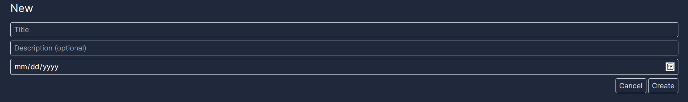
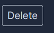
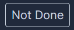
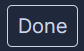
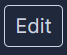
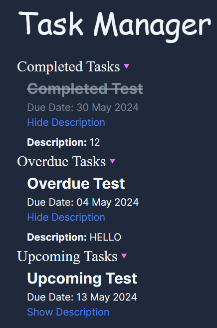
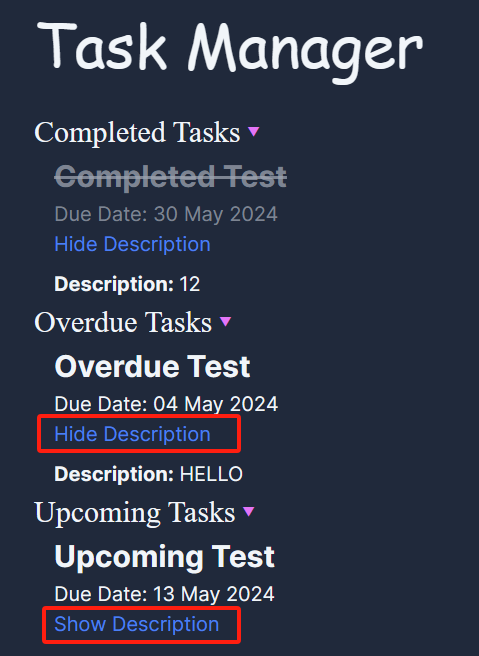
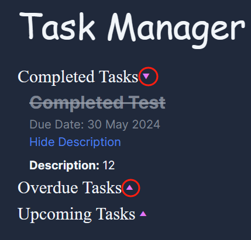

This is a [Next.js](https://nextjs.org/) project bootstrapped with [`create-next-app`](https://github.com/vercel/next.js/tree/canary/packages/create-next-app).

# Before Start
Download and install node.js from here
https://nodejs.org/en/download

After installed nodejs, install the dependency with the following commands.
```bash
npm install next
```
## Getting Started

First, run the development server:

```bash
npm run dev
# or
yarn dev
# or
pnpm dev
# or
bun dev
```

Open [http://localhost:3000](http://localhost:3000) with your browser to see the result.

By doing so, you can run it locally. If you see code marked error in your Editor, try install relevant extensions.

## Deployment on Vercel
https://task-manager-henna-theta.vercel.app/

## Funcionalities
### New Task
You can create a new task here.


Input based on your requirements.



### Delete Task
You can delete the selected task. 



### Toggle Task Completed Status
You can mark a task as `Done` or `Not Done` by clicking on the respective buttons.




### Update Task
You can edit an existing task here.



### Read Tasks
The tasks are grouped into `Completed`, `Overdue` and `Upcoming`. The tasks within a group is displayed chronologically.



You can toggle whether to show the description.



You can toggle whether to show a certain group of tasks.



## Notes During Developement

The documentation of next.js is not really helpful which would hinder the process of debugging. Following are some methods not mentioned in the official document that can achieve specific functionalities.

### Refactoring Functions
We refactor functions for two reasons.

Firstly, make the code cleaner.

Secondly, put client side and server side functions in different files.

When the function and the component uses the function are on same side, simply refactor using VSCode will work.

When they are not, put client side function in components, call it as `<MyComponent argument1={xxx} argument2={xxx}/>`.

One important note is, the file name containing the client side function component must start with capital letter, else the error `... is not a function` will be shown.

### Read Query From URL
This is a problem because the pages are server side rendered, and `useRouter` which is the old way to go can only be done at client side.

Moreover, `getServerSideProps` cannot be used because it's not supported in `app/.`, where next.js want you to put your codes in.

`export default async function Page({searchParams}: {searchParams?: { id?: string }})` is the way to go, read arguments when entering the page.

One with coding experience in other languages, say c++ or python, could notice this is like `main(*arg,**kwarg)`. Sadly this is not mentioned in official document.

### Change Web Icon
When creating one's own app, a customized icon is desired.

Sadly, many suggested ways that can be googled won't work, including simply placing the .ico in app or public folder or add a `<head>` element with link to your icon.

The easiest way to go is, in `layout.tsx` file, in `metadata` parameter, add the field `icons` and give the file path of your icon. 

### Real-time Update at Vercel Deployment
When deployed locally, the database will be updated and read every time entering a new page. Yet, by default, in Vercel deployment, the database is read everytime a new commit is done (and hence a new deployment).

To solve this, one needs to set the following parameters, to force the Vercel depolyment read the database whenever needed.
```bash
export const dynamic = 'force-dynamic'
export const fetchCache = 'force-no-store'
```
Some claims that simply set `export const fetchCache = 'force-no-store'` alone will work. In fact, it won't.